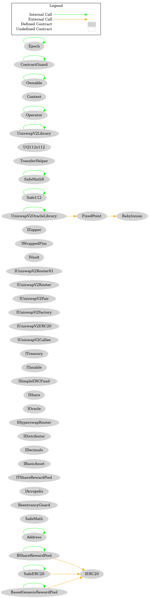
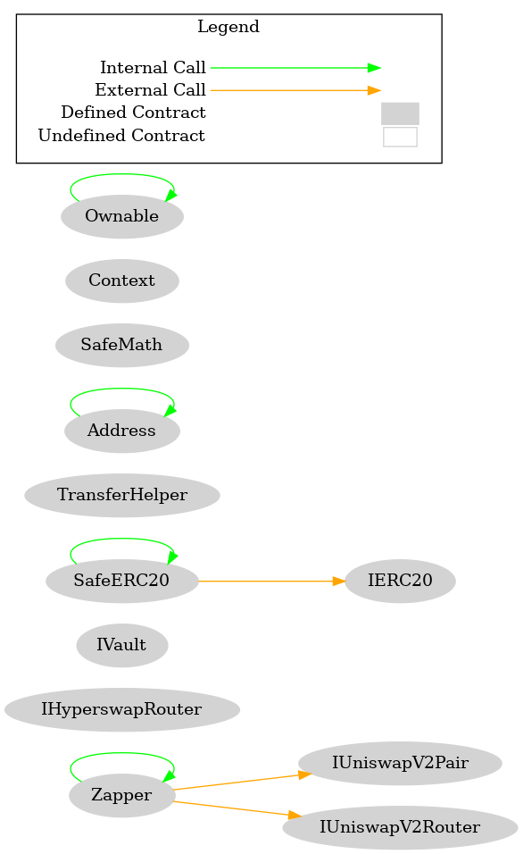
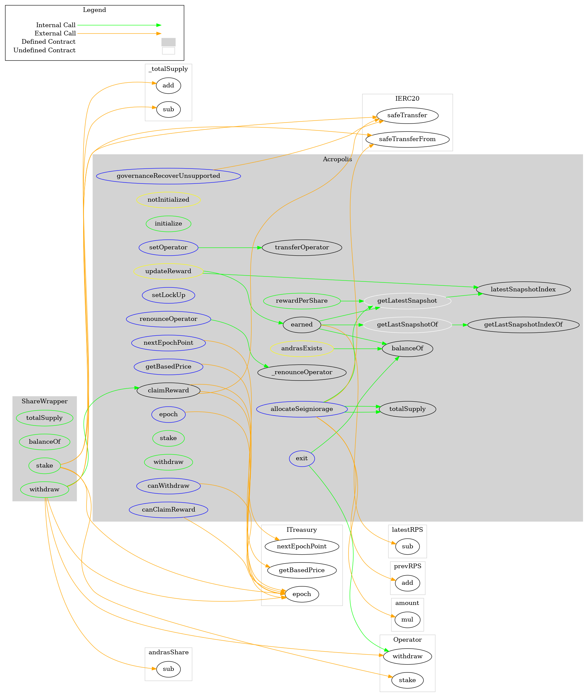

# 总体架构



上图是Based的总体架构图。感觉不是很清晰，也不太准确。这是用Surya生成的。

# 各个合约模块分析

## Operator

这个合约就是运营者（操作员的意思），继承它的合约，就表明合约有Operator这个概念，Operator可以移交给换人，最开始的Operator就是创建合约的地址msg.sender。有点类似有Owner的概念，所以Operator也继承了OpenZepplin的Owable，Context合约。这些继承都可以对一些合约函数进行权限访问等控制。

## SimpleERCFund


以上是继承图，SimpleERCFund继承了ISimpleERCFund的接口，该接口只有deposit和withdraw两个接口，描述了充值和提取XX代币，是什么代币需要传递相关的token地址。其实对于充值和提款的实现，这个合约都是操作OpenZeppline的SafeERC20的接口来做安全的转账和提取的。充值是充值到SimpleERCFund这个合约里面。

反正是封装了比较安全的ERC20操作。

## Timelock

这个时间锁合约，你在很多DeFi，DAOs里面都可以看到，很常用通用，它的目的就是发布一个交易，这个交易会在未来执行，也就是等待一段时间，让交易延迟执行而已。

这个Delay的时间长度，已经在这个合约的构造函数中指定了，有最大和最小值，还有一个admin的管理员，也就是只有管理员账户，可以对这个时间锁的合约进行常规使用，操作。

## Treasury

国库合约。国库合约一般都是管理资金赞助的合约。跟线上治理相关。

Treasury合约除了继承了Operator还继承了ContractGuard，ContractGuard给合约提供了一些保护: 就是继承Guard的合约，只能在一个块中使用一次它们的函数，如果继续被交易调用那么就报错，只能等下一个块的高度被调用。

从初始化函数上看:

```solidity
 function initialize(
        address _based,
        address _bbond,
        address _bshare,
        address _basedOracle,
        address _acropolis,
        uint256 _startTime
    ) public notInitialized onlyOperator {

    }
```

国库合约依赖based合约，bbond，bshare basedOracle, acropolis这些合约。acropolis是一个stake的合约。

```txt
 +  Treasury (ContractGuard, Operator)
    - [Pub] isInitialized
    - [Pub] nextEpochPoint
    - [Pub] getBasedPrice
    - [Pub] getBasedUpdatedPrice
    - [Pub] getReserve
    - [Pub] getBurnableBasedLeft
    - [Pub] getRedeemableBonds
    - [Pub] getBondDiscountRate
    - [Pub] getBondPremiumRate
    - [Pub] initialize #
       - modifiers: notInitialized,onlyOperator
```

这个国库合约会跟随着块的高度增高，不断地更新各种价格和其他参数，一些设置函数，必须需要该合约的运营者Operator才可以设置。总之整个国库的方法，调用了IOracle，IERC20，IAcropolis，IBasisAsset等接口


## Oracle

预言机合约，继承了Epoch合约，Epoch合约继承了Operator，同时Epoch加入了自己的限制，就是检查合约必须不能在下一次epoch被调用，只能在上一次的epoch中被调用。相当于给Oracle了一点时间来做事情。

因为用了Epoch，所以Oracle对价格的估算，在构造的时候，也是给定了一段时间period和startTime。这个Epoch记住，不是ETH共识里面的Epoch，是它们自己定义的业务型的Epoch时间区间。

Oracle构造的时候依赖了uniswap 2.0的交易对合约提供的接口。Oracle合约会定期更新一些从Uniswap那里获取的累计价格，和咨询价格，咨询consult的是uniswap交易对也就是token0 token1的单价乘以数量这样的价格。twap函数是实际的价格，也就是token0 token1在一段block间隔时间内的单位时间单价乘以数量，得到总价。

## Stater

本质上就是一个可以销毁的ERC20，还可以有Operator这个权限。这个Stater合约就是STATER代币，构造的时候会预挖出45个代币给团队。也可以转移其他ERC20代币到一个特定的地址上，只不过这个权限只有Operator可以做。

## ProfitDistribution

收益分布。继承了Operator，有Operator类似的权限。用了一些SafeERC20和IERC20的东西。它构造的时候要传入despositToken的存款ERC20进去。

可以奖励不同的ERC20的代币，这些作为奖励的ERC20代币可以由Operator随意添加，Operator可以提取奖励。

其他用户可以抵押despositToken到本合约，当然需要扣除一定的费用。也可以unstaked depositToken，也就是从本合约转到msg.sender地址，也要扣除一定的费用。

一些奖励不会马上发放，需要加入到用户的pendingRewards[i]中，必要时才统一发放这些不同类型的IERC20的代币奖励。

## Distributor

构造时会初始化一些IDistributor的接口列表，distribute方法被调用时，调用IDisxtributor的distribute方法。实现这个IDistributor的合约目前没有找到，应该是第三方的合约传递进来的。


## BShare

BShare也是一种可销毁的ERC20代币，有Operator的权限。代币名字就叫BSHARE。构造的时候会预挖10个BSHARE给部署合约的账户（也就是开发团队）。

然后token总量会挖到一个奖励池子，挖50000个BSHARE代币。

也可以转移其他ERC20代币到一个特定的地址上，只不过这个权限只有Operator可以做。这点与Stater一致。

## BBond

BBond也是一种可销毁的ERC20代币，有Operator权限，就叫BBOND。但是构造的时候没有预挖这个动作。

Operator可以mint 一定数量的BBOND代币给某个特定账户

msg.sender可以销毁它的代币。账户余额减去销毁额度。

也可以销毁指定账户的一定数量的代币。

也可以转移其他ERC20代币到一个特定的地址上，只不过这个权限只有Operator可以做。这点与Stater，BShare一致。

## Based

Based是一种可销毁的ERC20代币，有Operator权限。代币名字叫BASED。是Based Finance里面最重要的一种代币。构造的时候会预挖5000 BASED给团队。

- 有Based代币的预言机，预言机可以咨询本合约BASED代币的价格
- Operator可以mint 一定数量的BASED代币到指定的地址上
- msg.sender可以销毁自己一定数量的代币
- Operator可以销毁其他账户一定数量的代币
- 可以转移某个sender(owner)地址下的代币到另一个地址，并授权msg.sender可以花费指定的代币限额
- Operator只能分发一次奖励，分发奖励本质就是把BASED代币mint到gensisPool和daoFund两个地址下
- 转移其他ERC20代币到一个特定的地址上，只不过这个权限只有Operator可以做。这点与Stater，BShare一致。(与Stater， BSHARE BBond一样)

## BShareSwapper

BShare的去中心化交易所(DEX). 构造的时候依赖BShare，BBond，Based这三个ERC20合约的地址，也依赖basedOracle，bshareOracle这两个预言机的地址，依赖国库合约的地址，依赖Zapper合约的地址。

这个Swapper也有Operator的权限。

- 从bshareOracle和basedOracle中获取相应的代币价格
- 获取Based BShare 代币关于这个Swapper合约地址上的余额，获取特定用户地址BBond的余额
- 从BBond换到BShare的swap方法，首先BBond先换到Based，再由Based换到BShare上，底层都是调用Zapper
- 从国库中赎回BBond，也就是燃烧掉BBond，换回Based，这个赎回BBond功能，swap方法会用到
- 有一个变化的值，一个based的价格相当于多少BShare数额。

Based是一个中间的代币，用于swap的。也是后面会提到的平台币

## Zapper

Zapper有Ownable的权限，是一个比较底层的DEX。它有一个Native的代币，也就是Based，Based就是平台币了。

目前感觉本合约只通过IZapper这个接口用了_swap这个方法，其他的方法没有用。IZapper才提供两个方法。



## Acropolis

这个模块里面有一个ShareWrapper，就是BShare代币的简单封装，并且Acropolis合约会直接继承它，并初始化这个share合约的IERC20地址。

Acropolis的初始化依赖Based，BShare，还有国库合约的地址。与国库合约一样，它除了继承Operator有Operator的权限，还有ContractGuard合约，这个合约提供了一个保护，一个块中这个合约只能被调用一次的modifier。




acropolisHistory存储stake奖励的快照。快照是按照区块的高来存放的。

- 对BShare的充提(stake, withdraw)
- 提币的时候会有奖励，但要rewardLockupEpochs的时间周期过去以后，才可以拿到奖励，并提币成功


